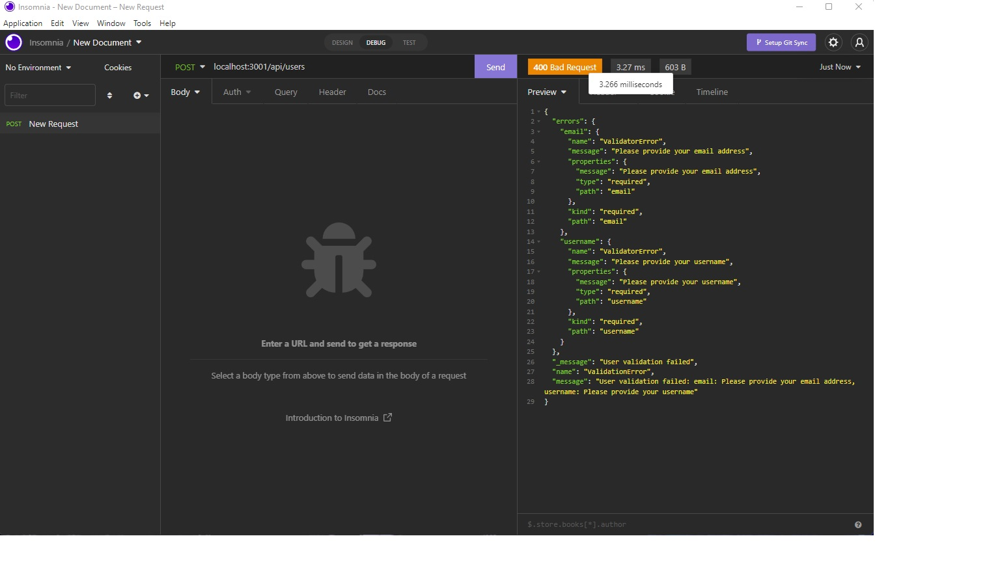

# NoSQL Social Network API

### NoSQL Challenge 18: Social Network API

## Project Description
This project is a social network that allose users to shair their thoughts, react to posts made by friends and create a friends list. Users can also create, update and delete their data in the database.

## Installation
You can clone the project from GitHub by copying either HTTPS or SSH link or by downloading the project as a zip file. Run npm install do install needed packages. run npm run develop to start servers

## Usage
In command Prompt go to the root directory and type the command npm start. The next step is to go to insomnia to run the app.

## Screenshot
![Screenshot]

  

## Contribution
Made by Joe Chaaya